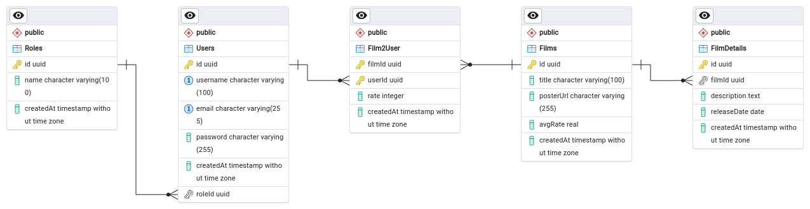
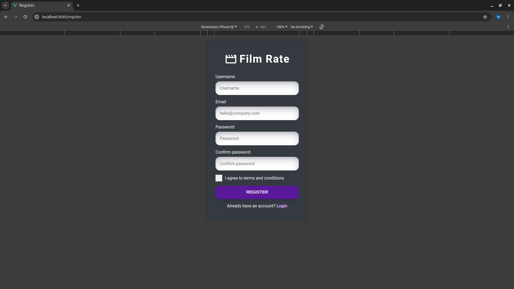
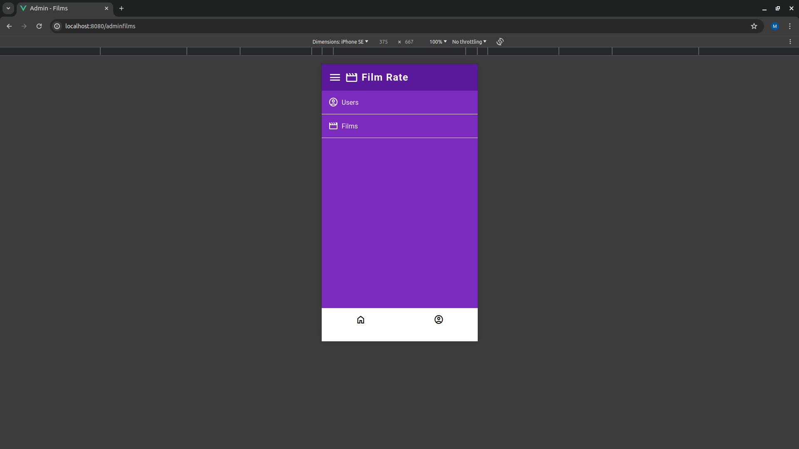

# Film Rate

## Table of content
- [App description](#app-description)
- [Tech stack](#tech-stack)
- [Database design and structure](#database-design-and-structure)
- [Installation](#installation)
- [Usage](#usage)
- [Features](#features)
- [Screenshots](#screenshots)

## App description
Film Rate is the web application to rate films. The user can rate film, modify and remove it. The admin can also manage films and users. The web application allows to login to existing account and register a new one.

## Tech stack
- Git
- Docker
- HTML
- CSS
- JavaScript
- PHP
- PostgreSQL
- Xdebug

## Database design and structure
### ERD Diagram


### SQL dumps
- `db.sql` - Database schema, basic roles and users
- `dbSchema.sql` - Database schema only

## Installation
### Requirements
- Docker

### Process of installation
```shell
# Clone repository
git clone git@github.com:MikiWojak/film-rate.git

# Go to project directory
cd film-rate

# Copy config.php.example to create config.php
cp config.php.example config.php

# Add priviledges to public/uploads
(sudo) chmod 777 public/uploads

# Build docker images
# It might take 5-10 minutes
docker-compose build

# Install composer packages
docker-compose run --rm composer install

# Run docker containers in the background
docker-compose up -d

# Load SQL dump (e. g. `db.sql` - schema and basic data)
# On default settings
docker-compose exec -T db psql -U docker db < db.sql
```

## Usage
### Run web application
```shell
# Run docker containers in the background
docker-compose up -d
```

### Shut down web application
```shell
# Shut down docker containers
docker-compose down
```

### Web application
- Go to location http://localhost:8080
- You can use application as unauthorized [Guest](#guest), however your possibilities will be significantly limited
- Click Login icon:
  - Desktop - top right
  - Mobile - bottom right (tab bar)
- Login using one of these credentials:
  - User with role [Admin](#admin):
    - Email: **admin@filmrate.test**
    - Password: **Qwerty123!**
  - User with role [User](#user):
    - Email: **user@filmrate.test**
    - Password: **Qwerty123!**
- Now you can do actions permitted for specific role

### pgAdmin
- Go to location http://localhost:5050
- Login using credentials (default ones):
  - Email Address / Username: **admin@example.com**
  - Password: **admin**
- Register database server using *internal credentials* (default ones):
  - Host name/address: **db**
  - Port: **5432**
  - Maintenance database: **db**
  - Username: **docker**
  - Password: **docker**
- Now you can manage the database

### Unit tests
```shell
# Run unit tests
docker-compose run --rm phpunit
```

## Features
### Guest
(unauthorized)
- View films
- Search films by title
- View single film
- Login
- Register

### User
- View films
- Search films by title
- Filter films - only rated by logged user
- View single film
- Rate film, edit and remove rate
- Profile page

### Admin
All User's features, also:
- See all films
- Add, edit, remove film
- See all users
- Remove user

## Screenshots
### Desktop - Films

### Desktop - Single film

### Desktop - Register

### Desktop - Login

### Desktop - Rate film

### Desktop - Profile

### Desktop - Admin films

### Desktop - Admin add film


### Mobile - Films

### Mobile - Single film

### Mobile - Register

### Mobile - Login

### Mobile - Rate film

### Mobile - Profile

### Mobile - Admin films


### Mobile - Admin add film

